# WagerLoop Architecture Overview

## Core Modules
- `lib/pages/`: Flutter screens (profile, betting, social feed)
  - `auth/`: Authentication screens (login, register, onboarding)
  - `picks/`: Betting functionality (create pick page)
  - Social screens (discover, news, scores, social feed)
  - Profile screens (profile page, user profile, followers list)
- `lib/services/`: Backend integration (Supabase, authentication, social features)
  - Authentication, social feed, image upload, sports API integration
  - Real-time profile updates, sports odds service
- `lib/models/`: Data structures (User, Post, Pick, Comment, etc.)
  - Core models (comment, pick_post, post)
  - Sports models (game, odds, player, sportsbook, team)
- `lib/widgets/`: Reusable UI components (profile avatars, betting cards, etc.)
  - Profile avatars, picks display widgets, dice loading animations
- `lib/utils/`: Utility functions (loading, team logos)
- `lib/layouts/`: Layout components
- `lib/wrappers/`: Wrapper components

## Key Features
- **Authentication**: User registration, login, profile management, onboarding
- **Sports Betting**: Pick creation, parlay building, odds calculation
- **Social Platform**: Posts, likes, comments, reposts, user following
- **User Profiles**: Personal stats, liked posts, betting history, followers/following
- **Sports Data**: Live scores, news, game information, team data
- **Discovery**: Explore and discover new content and users

## Architecture Diagram

```mermaid
graph TD
    %% UI Layer
    CreatePickPage[Create Pick Page] --> SocialFeedService
    ProfilePage[Profile Page] --> AuthService
    UserProfilePage[User Profile Page] --> AuthService
    SocialFeedPage[Social Feed Page] --> SocialFeedService
    DiscoverPage[Discover Page] --> SocialFeedService
    NewsPage[News Page] --> SportsApiService
    ScoresPage[Scores Page] --> SportsApiService
    
    %% Auth Layer
    LoginPage[Login Page] --> AuthService
    RegisterPage[Register Page] --> AuthService
    OnboardingPage[Onboarding Page] --> AuthService
    
    %% Services Layer
    AuthService[Auth Service] --> Supabase[Supabase Backend]
    SocialFeedService[Social Feed Service] --> Supabase
    ImageUploadService[Image Upload Service] --> Supabase
    SportsApiService[Sports API Service] --> ExternalAPI[External Sports API]
    SportsOddsService[Sports Odds Service] --> ExternalAPI
    RealtimeProfileService[Realtime Profile Service] --> Supabase
    
    %% Models
    AuthService --> User[User Model]
    SocialFeedService --> Post[Post Model]
    SocialFeedService --> PickPost[Pick Post Model]
    SocialFeedService --> Comment[Comment Model]
    SportsApiService --> Game[Game Model]
    SportsApiService --> Team[Team Model]
    SportsApiService --> Player[Player Model]
    SportsOddsService --> Odds[Odds Model]
    SportsOddsService --> Sportsbook[Sportsbook Model]
    
    %% External
    Supabase --> Database[(PostgreSQL)]
    Supabase --> Storage[(File Storage)]
    ExternalAPI --> SportsData[(Sports Data)]
```


## Current Implementation Notes
- **State Management**: Using setState() with optimistic updates for social interactions
- **Database**: Supabase with PostgreSQL for user data, posts, likes, follows
- **Authentication**: Supabase Auth with profile management and onboarding flow
- **File Upload**: Supabase Storage for profile pictures and post images
- **Social Features**: Real-time like/comment/repost functionality with follow system
- **Betting Logic**: Pick creation with parlay support and odds calculation
- **Sports Data**: Integration with external sports APIs for live scores and news
- **UI Components**: Custom splash screens, loading animations, profile avatars
- **Real-time Updates**: Live profile updates and social feed synchronization

## File Structure
```
lib/
├── pages/
│   ├── auth/
│   │   ├── login_page.dart
│   │   ├── register_page.dart
│   │   └── onboarding_page.dart
│   ├── picks/
│   │   └── create_pick_page.dart
│   ├── discover_page.dart
│   ├── news_page.dart
│   ├── scores_page.dart
│   ├── social_feed_page.dart
│   ├── profile_page.dart
│   ├── user_profile_page.dart
│   └── followers_list_page.dart
├── services/
│   ├── auth_service.dart
│   ├── social_feed_service.dart
│   ├── image_upload_service.dart
│   ├── sports_api_service.dart
│   ├── sports_odds_service.dart
│   └── realtime_profile_service.dart
├── models/
│   ├── comment.dart
│   ├── pick_post.dart
│   ├── post.dart
│   └── sports/
│       ├── game.dart
│       ├── odds.dart
│       ├── player.dart
│       ├── sportsbook.dart
│       └── team.dart
├── widgets/
│   ├── profile_avatar.dart
│   ├── picks_display_widget.dart
│   └── dice_loading_widget.dart
└── utils/
    ├── loading_utils.dart
    └── team_logo_utils.dart
```

## Recent Changes
- Fixed purple color usage in parlay picker to match green theme
- Added liked posts section to user profiles with accurate counts
- Implemented overflow handling in betting UI
- Enhanced profile pages with follower/following functionality
- Added comprehensive sports data integration
- Implemented real-time profile updates
- Created custom splash screens and loading animations

## Technical Specifications
- **Framework**: Flutter
- **Backend**: Supabase (PostgreSQL + Real-time + Storage)
- **Authentication**: Supabase Auth
- **State Management**: setState() with optimistic updates
- **External APIs**: Sports data providers for live scores and odds
- **File Storage**: Supabase Storage for images
- **Real-time**: Supabase Real-time subscriptions

Update this file as WagerLoop's architecture evolves.